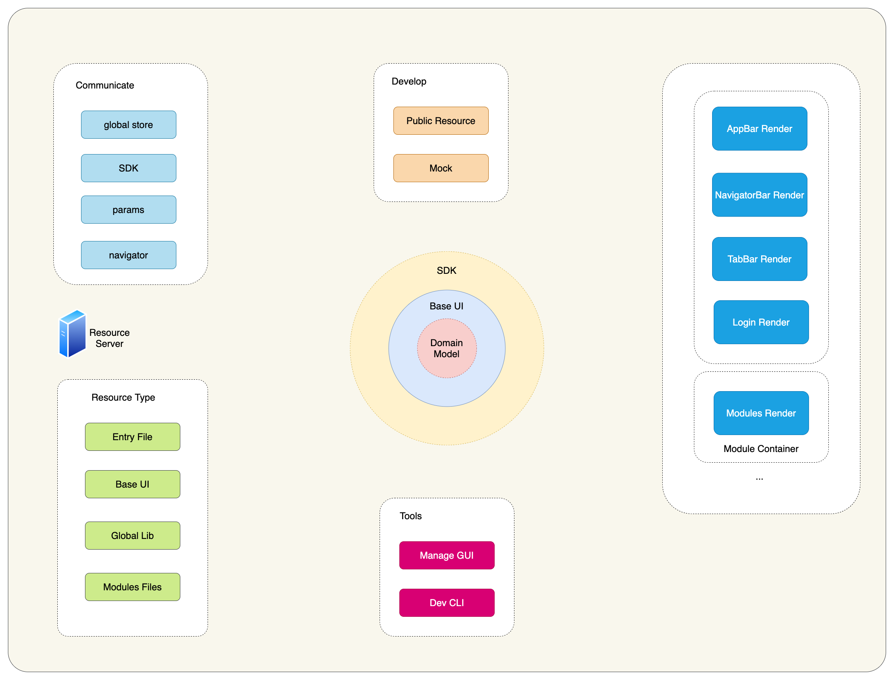

## 应用架构

### 前端整体设计



#### 应用基座

- 应用全局数据模型
- 渲染资源加载
- 布局视图渲染控制
- 模块视图渲染控制
- 通信枢纽
- 导航

#### 基座能力

- 应用共享状态: global store
- 内置 sdk: inherent-sdk, 提供 **基座** 与 **基础 UI** 通信使用
- 开放 sdk: open-sdk, 提供 **基座** 与 **模块** 通信使用

## 渲染流程

```
@startuml

control store as Store
participant View as View
participant MainHTML as MainHTML
participant MainJS as MainJS
participant SDK as SDK
entity AppBar as AppBar
entity NavBar as NavBar
entity TabBar as TabBar
entity Module1 as Module1

MainHTML -> MainJS: get entry file
View --> MainHTML: keep update

group BaseUI
MainJS -> AppBar: load resource
AppBar -> View: mount/update
AppBar -> SDK: call
SDK -> Store ++: update
Store -> SDK --: emit
SDK --> AppBar --: broadcast
end

group BaseUI
MainJS -> NavBar: load resource
NavBar -> View: mount/update
NavBar -> SDK: call
SDK -> Store ++: update
Store -> SDK --: emit
SDK --> NavBar --: broadcast
end

group BaseUI
MainJS -> TabBar: render
TabBar -> View: mount/update
TabBar -> SDK: call
SDK -> Store ++: update
Store -> SDK --: emit
SDK --> NavBar --: broadcast
SDK --> TabBar --: broadcast
end

group MountModule
NavBar -> SDK: select Module1
SDK -> Store ++: update
Store -> MainJS --: onModuleViewChange
MainJS -> Module1: load resource
Module1 -> View: mount/update
TabBar -> SDK: call
SDK -> Store: emit
Store --> Module1: broadcast
end

@enduml
```
